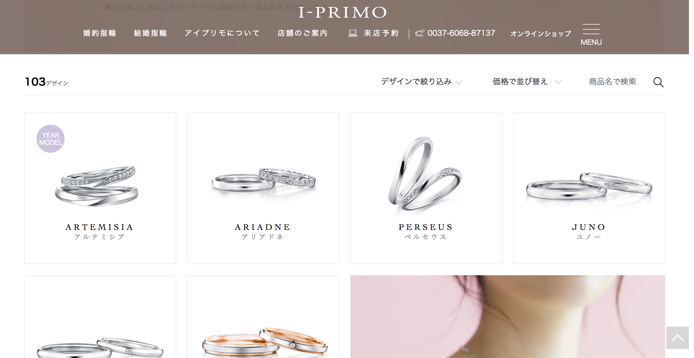
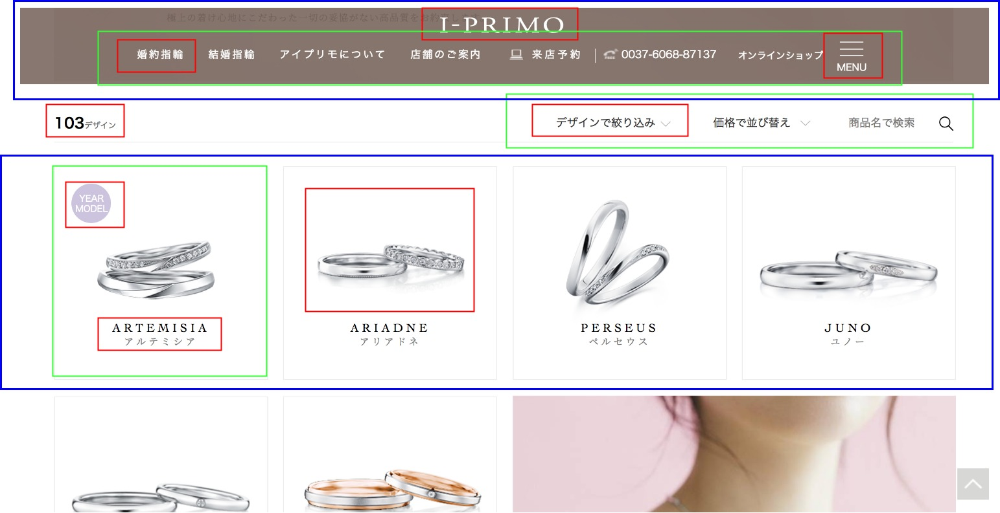

---?color=linear-gradient(to right, #021B79, #0575E6)
@title[Introduction]

@snap[west headline text-white span-70]
コンポーネント 指向で始める *UI設計*
@snapend

@snap[south-west byline  text-white]
企画制作部 那須 毅康
@snapend

---?color=linear-gradient(to right, #021B79, #0575E6)
@title[本題の前に]

@snap[north]
いきなりですが...
@snapend

### @color[white](Atomic Designやコンポーネント指向という言葉を聞いたことがある方<i class="em em-hand"></i>)

@snap[south list-content-concise text-white span-100]
@ul
- コンポーネント指向とは何かを話す前に、まず少しだけUIが複雑になってきている背景を説明したいと思います。
@ulend
@snapend

---?color=linear-gradient(to right, #021B79, #0575E6)
@title[Agenda]

@snap[west split-screen-heading text-pink span-50]
Agenda!
@snapend

@snap[east list-content-concise text-white span-65]
@ul[list-bullets-circles](false)
- UI複雑化の背景
- そもそもコンポーネント指向とは?
- コンポーネント・ベースでUIを開発する場合のメリット
- コンポーネント・ベースでの設計の基本と分割基準
@ulend
@snapend

---?color=linear-gradient(to right, #021B79, #0575E6)
@title[Why UI be complicated?]

## @color[white](UI複雑化の背景)

---?color=linear-gradient(to right, #021B79, #0575E6)
@title[UI複雑化の背景]

@snap[east list-content-concise text-white span-100]
@ul[list-bullets-circles]
- @color[#E71E60](html5/css3の登場)
  - このことによりJavaScriptやcssで実現できることが増加
  - SPA(シングルページアプリケーション)やPWA(プログレッシブウェブアプリ)のような、web技術を使った新たなサービスの出現
- @color[#E71E60](ユーザーが使う端末の種類が増加)
  - 各デバイスの大きさに対応したUIを設計しなければならない
  - 今やiPhoneだけでも6種類の画面サイズがある
@ulend
@snapend

---?color=linear-gradient(to right, #021B79, #0575E6)
@title[様々なリスク]

@snap[west text-white span-100]
## @color[white](複雑化することによって @color[#E71E60](開発期間の長期化)や @color[#E71E60](不具合・デグレ)が起きる リスクが高まります)
@snapend

---?color=linear-gradient(to right, #021B79, #0575E6)
@title[今後どのようにアプローチしていけばよいのか?]

@snap[west span-100]
### @color[white](複雑化するUIに対して、今後どのようにアプローチしていけばよいのか?<i class="em em-thinking_face"></i>?) 
@snapend

@snap[south list-content-concise text-white span-100]
@ul
- いろいろな方法があると思いますが、その方法の一つであるコンポーネント指向をベースとしたUI開発について、メリットや設計方法などをお話ししたいと思います。
@ulend
@snapend

---?color=linear-gradient(to right, #021B79, #0575E6)
@title[そもそもコンポーネントとは1]

@snap[west text-white span-100]
### @color[white](そもそも コンポーネント@color[#E71E60](指向)とは?<i class="em em-thinking_face"></i>??)
@snapend

---?color=linear-gradient(to right, #021B79, #0575E6)
@title[そもそもコンポーネントとは2]

@snap[east list-content-concise text-white span-100]
@ul[list-bullets-circles]
- そもそもコンポーネントとは、ある機能を実現するために部品化されたソフトウェアのこと
- その部品化されたものを、webの画面を構成する各パーツに当てはめ画面を作成する考え方です。下記4つの特徴があります
  @ol[plit-screen-list]
  - カプセル化されている
  - 置換可能である
  - 再利用可能である
  - コンポーネントを別のコンポーネントに組み合わせて作成可能である
  @olend
@ulend
@snapend

---?color=linear-gradient(to right, #021B79, #0575E6)
@title[つまり]

@snap[north text-white]
つまり...
@snapend

@snap[west text-white span-100]
### @color[white](UIが持つ機能を@color[#E71E60](カプセル化)し、UI同士の@color[#E71E60](置換や再利用)が可能な状態にして、組み合わせることにより、より@color[#E71E60](別の大きなUIを作る)ことができるように設計/実装することと言えます。)
@snapend

---?color=linear-gradient(to right, #021B79, #0575E6)
@title[result]

@snap[north text-white]
Example
@snapend

@snap[east split-screen-img]

@snapend

@snap[west split-screen-img]

@snapend

@snap[south-west template-note text-gray]
カプセル化し、UI同士の置換や再利用が可能な状態にして、組み合わせることにより、より別の大きなUIを作ることができるように実装します
@snapend

---?color=linear-gradient(to right, #021B79, #0575E6)
@title[メリット1]

@snap[west text-white span-100]
### @color[white](Uコンポーネント・ベースで UIを開発する場合の)@color[#E71E60](メリット)
@snapend

---?color=linear-gradient(to right, #021B79, #0575E6)
@title[メリット2]

@snap[east list-content-concise text-white span-100]
@ul[list-bullets-circles]
- 再利用で実装量を減らす
- 平行開発で待ち時間を最小化
- 仕様変更による手戻り作業を最小化
- 新規参入開発メンバーを最短で戦力化
- 複数のテスト・アプローチでテスト工数を下げる
- 複数アプリケーションの開発を容易にする
@ulend
@snapend

---?color=linear-gradient(to right, #021B79, #0575E6)
@title[設計の基本と分割基準1]

@snap[west text-white]
### @color[white](コンポーネント・ベースでの設計の基本と分割基準)
@snapend

---?color=linear-gradient(to right, #021B79, #0575E6)
@title[設計の基本と分割基準]

@snap[east list-content-concise text-white]
@ul[list-bullets-circles]
- 依存関係の整理(小さなコンポーネントが大きなコンポーネントを含まない/その逆はOK)
- 一つのコンポーネントが責任を持つ問題は1つ
- コンポーネントが担当する目的別
@ulend
@snapend

--?color=linear-gradient(to right, #021B79, #0575E6)
@title[設計の基本と分割基準の具体的方法]

@color[white](
具体的には

インターフェース・インベントリ(サイトやアプリを構成する UI 部品の一覧を作る。いわゆるスタイルガイド)
ちょっと大きめのサイトを作る場合はスタイルガイドも作りましょう

その結果、UIが複雑なサイトやアプリケーションの開発が用意になります。
)

--?color=linear-gradient(to right, #021B79, #0575E6)
@title[スタイルガイドのサンプル]

スタイルガイドのサンプル

---?color=linear-gradient(to right, #021B79, #0575E6)
@title[まとめ]

snap[west split-screen-heading text-pink span-30]
まとめ
@snapend

@snap[east list-content-concise text-white span-70]
@ul[list-bullets-circles](false)
- 今後もweb技術の発展と共にUIは複雑になっていきそう
- 複雑化したUIに対するアプローチの一つとしてコンポーネント指向をベースとしたUI開発があります
- UIが持つ機能をカプセル化し、UI同士の置換や再利用が可能な状態にして、組み合わせることにより、より別の大きなUIを作ることができるように実装します
- それなりの規模のサイトを作る場合はスタイルガイドを作りましょう
@ulend
@snapend

---?color=linear-gradient(to right, #021B79, #0575E6)
@title[まとめ]

@color[white](## **ご静聴ありがとうございました**)

---
@title[Tip! Fullscreen]

 
For the best viewing experience, press F for fullscreen.
@css[template-note](We recommend using the *SPACE* key to navigate between slides.)

---?include=template/md/split-screen/PITCHME.md

---?include=template/md/sidebar/PITCHME.md

---?include=template/md/list-content/PITCHME.md

---?include=template/md/boxed-text/PITCHME.md

---?include=template/md/image/PITCHME.md

---?include=template/md/sidebox/PITCHME.md

---?include=template/md/code-presenting/PITCHME.md

---?include=template/md/header-footer/PITCHME.md

---?include=template/md/quotation/PITCHME.md

---?include=template/md/announcement/PITCHME.md

---?include=template/md/about/PITCHME.md

---?include=template/md/wrap-up/PITCHME.md

---
@title[The Template Docs]

@snap[west span-100]
### **Now it's @color[#E49436](your) turn.**

 

#### Use these templates to create custom slides.
#### **Then amaze your audience with a Git@color[#E49436](Pitch) slideshow @fa[smile-o]**
@snapend

@snap[south docslink span-100]
For supporting documentation see the [The Template Docs](https://gitpitch.com/docs/the-template)
@snapend