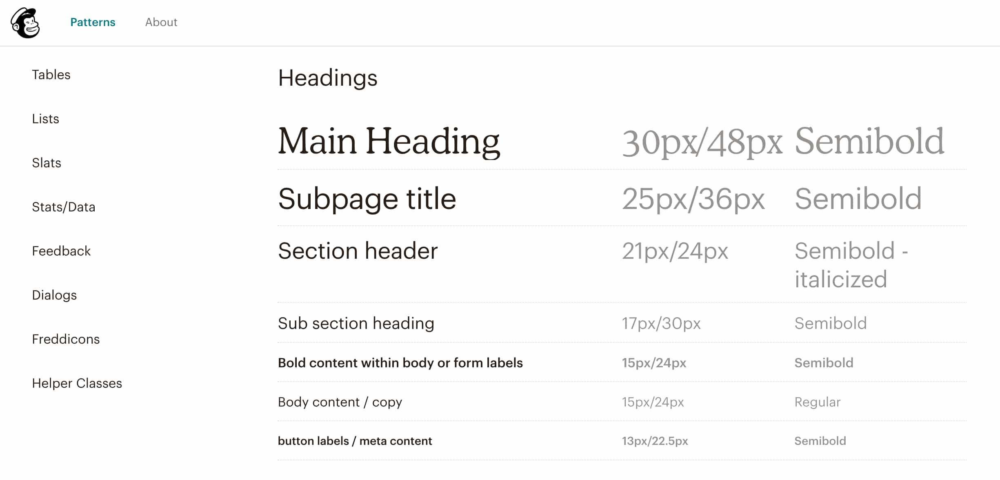
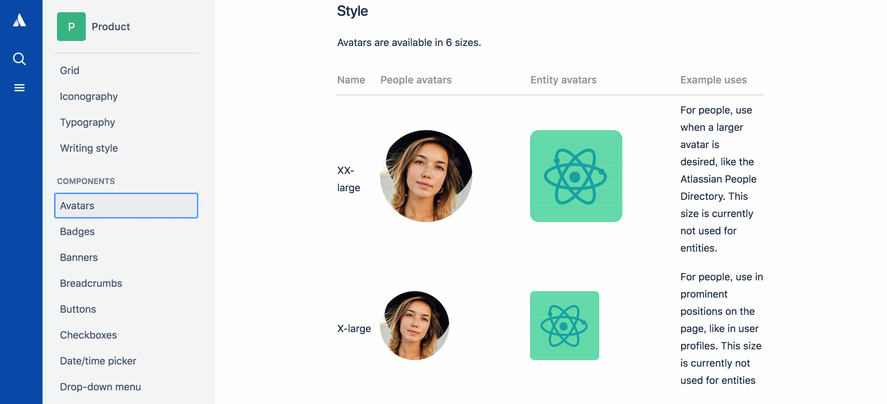

---?color=linear-gradient(to right, #021B79, #0575E6)
@title[Introduction]

@snap[west headline text-white span-70]
コンポーネント 指向で始める *UI設計*
@snapend

@snap[south-west byline  text-white]
企画制作部 那須 毅康
@snapend

Note:

- あいさつ
- 今月はコンポーネント指向で始めるUI設計、というテーマで少しお話ししたいと思います。
- 自分もまだコンポーネント指向については勉強中で、実践しているわけではないのですが、今後、サイト開発をする上で役立ちそうなことが多いので、そのあたりのことを共有できたらいいかなと思います。

---?color=linear-gradient(to right, #021B79, #0575E6)
@title[本題の前に]

@snap[north]
@color[white](いきなりですが...)
@snapend

@snap[west]
### @color[white](**Atomic Design**や **コンポーネント指向**という言葉を 聞いたことがある方<i class="em em-hand"></i>)
@snapend

@snap[south list-content-concise text-white span-100]
@ul
- コンポーネント指向とは何かを話す前に、UIが複雑になってきている背景を少し説明したいと思います。
@ulend
@snapend

Note:

- webのUIが複雑になってきている
- Atomic Designやコンポーネント指向という考え方が生まれる背景を知っておいた方が、コンポーネント指向がなぜ必要になるのか、がわかりやすいので、先に背景について説明したいと思います。

---?color=linear-gradient(to right, #021B79, #0575E6)
@title[Agenda]

@snap[west split-screen-heading text-pink span-50]
Agenda!
@snapend

@snap[east list-content-concise text-white span-65]
@ul[list-bullets-circles](false)
- UI複雑化の背景
- そもそもコンポーネント指向とは?
- コンポーネント・ベースでUIを開発する場合のメリット
- コンポーネント・ベースでの設計の基本と分割基準
@ulend
@snapend

---?color=linear-gradient(to right, #021B79, #0575E6)
@title[Why UI be complicated?]

## @color[white](UI複雑化の背景)

---?color=linear-gradient(to right, #021B79, #0575E6)
@title[UI複雑化の背景]

@snap[east list-content-concise text-white span-100]
@ul[list-bullets-circles]
- @color[#E71E60](HTML5/CSS3の登場)
  - このことによりJavaScriptやcssで実現できることが増加
  - SPA(シングルページアプリケーション)やPWA(プログレッシブウェブアプリ)のような、web技術を使った新たなサービスの出現
- @color[#E71E60](ユーザーが使う端末の種類が増加)
  - 各デバイスの大きさに対応したUIを設計しなければならない
  - 今やiPhoneだけでも6種類の画面サイズがある
@ulend
@snapend

Note:

- 2014年10月にhtml5が正式勧告
- googleMapみたいにajaxを使ってユーザーがインタラクティブに操作できるwebサイトが増加
- タブレットを含めるとその数は...

---?color=linear-gradient(to right, #021B79, #0575E6)
@title[様々なリスク]

@snap[west text-white span-100]
## @color[white](複雑化することによって @color[#E71E60](**開発期間の長期化**)や @color[#E71E60](**不具合・デグレ**)が起きる リスクが高まります)
@snapend

---?color=linear-gradient(to right, #021B79, #0575E6)
@title[今後どのようにアプローチしていけばよいのか?]

@snap[west list-content-concise text-white span-100]
### @color[white](複雑化するUIに対して、今後どのようにアプローチしていけばよいのか?<i class="em em-thinking_face"></i>)
@ul[list-bullets-circles]
- いろいろな方法があると思いますが、その方法の一つであるコンポーネント指向をベースとしたUI開発について、メリットや設計方法などをお話ししたいと思います。
@ulend
@snapend

---?color=linear-gradient(to right, #021B79, #0575E6)
@title[そもそもコンポーネントとは1]

@snap[west text-white span-100]
### @color[white](そもそも コンポーネント@color[#E71E60](指向)とは?)
@snapend

---?color=linear-gradient(to right, #021B79, #0575E6)
@title[そもそもコンポーネントとは2]

@snap[east list-content-concise text-white span-100]
@ul[list-bullets-circles]
- そもそもコンポーネントとは、ある機能を実現するために部品化されたソフトウェアのこと
- その部品化されたものを、webの画面を構成する各パーツに当てはめ画面を作成する考え方です。下記4つの特徴があります
  @ol
  - カプセル化されている
  - 置換可能である
  - 再利用可能である
  - コンポーネントを別のコンポーネントに組み合わせて作成可能である
  @olend
@ulend
@snapend

Note:

- カプセル化とは、例えば車を運転する場合、ドライバーは運転方法のみ知っていればよく、エンジンがどのように動くのかを知っておく必要がない

---?color=linear-gradient(to right, #021B79, #0575E6)
@title[つまり]

@snap[north text-white]
つまり...
@snapend

@snap[west text-white span-100]
### @color[white](UIが持つ機能を@color[#E71E60](カプセル化)し、UI同士の@color[#E71E60](置換や再利用)が可能な状態にして、組み合わせることにより、@color[#E71E60](別の大きなUIを作る)ことができるように設計/実装すること。)
@snapend

Note:

- つまり、コンポーネント指向とは

---?color=linear-gradient(to right, #021B79, #0575E6)
@title[Example]

@snap[north text-white]
例えばiprimoの場合
@snapend

@snap[midpoint]

@snapend

@snap[south-west template-note text-white span-100]
枠でカッコっている部分をそれぞれ一つのコンポーネントとみなし、カプセル化、UI同士の置換や再利用が可能な状態にして、別の大きなUIを作ることができるように実装します
@snapend

Note:

- ここではiprimoを例にコンポーネント指向で設計/実装する場合を考えてみます
- 赤枠が最も小さいコンポーネントで、それを組み合わせて緑枠のコンポーネント、緑枠のコンポーネントを組み合わせて青枠のコンポーネントを作っていきます。

---?color=linear-gradient(to right, #021B79, #0575E6)
@title[メリット1]

@snap[west text-white span-100]
### @color[white](Uコンポーネント・ベースで UIを開発する場合の)@color[#E71E60](メリット)
@snapend

---?color=linear-gradient(to right, #021B79, #0575E6)
@title[メリット2]

@snap[east list-content-concise text-white span-100]
@ul[list-bullets-circles]
- 再利用で実装量を減らす
- 平行開発で待ち時間を最小化
- 仕様変更による手戻り作業を最小化
- 新規参入開発メンバーを最短で戦力化
- 複数のテスト・アプローチでテスト工数を下げる
- 複数アプリケーションの開発を容易にする
@ulend
@snapend

---?color=linear-gradient(to right, #021B79, #0575E6)
@title[設計の基本と分割基準1]

@snap[west text-white]
### @color[white](コンポーネントの分割基準)
@snapend

---?color=linear-gradient(to right, #021B79, #0575E6)
@title[分割基準]

@snap[east list-content-concise text-white]
@ul[list-bullets-circles]
- 依存関係の整理(小さなコンポーネントが大きなコンポーネントを含まない/その逆はOK)
- 一つのコンポーネントが責任を持つ問題は1つ
- コンポーネントが担当する目的別
@ulend
@snapend

---?color=linear-gradient(to right, #021B79, #0575E6)
@title[分割基準の具体的方法]

@snap[west text-white]
@color[white](具体的には)
####  @color[white](@fa[angle-right] インターフェース・インベントリ（サイトやアプリを構成する UI 部品の一覧。いわゆるスタイルガイド）を作る)
#### @color[white](@fa[angle-right] ちょっと大きめのサイトを作る場合はスタイルガイドも作りましょう)
#### @color[white](@fa[angle-right] その結果、UIが複雑なサイトやアプリケーションの開発が用意になります。)
@snapend

---?color=linear-gradient(to right, #021B79, #0575E6)
@title[スタイルガイドのサンプル]

@snap[north]
@color[white](スタイルガイドのサンプル)
@snapend

@snap[west split-screen-img-50]

@snapend

@snap[east split-screen-img-50]

@snapend

@snap[south-west template-note text-white span-100]
左 UI インベントリー — Website Usability Info https://website-usability.info/2015/10/entry_151017.html
 
右 Website Style Guide Resources http://styleguides.io/
@snapend

---?color=linear-gradient(to right, #021B79, #0575E6)
@title[まとめ]

@snap[west split-screen-heading text-pink span-25]
まとめ
@snapend

@snap[east list-content-concise text-white span-75]
@ul[list-bullets-circles](false)
- 今後もweb技術の発展と共にUIは複雑になっていきそう
- UIが持つ機能をカプセル化し、UI同士の置換や再利用が可能な状態にして、組み合わせることにより、より別の大きなUIを作ることができるように実装します
- それなりの規模のサイトを作る場合はスタイルガイドを作りましょう
@ulend
@snapend

---?color=linear-gradient(to right, #021B79, #0575E6)
@title[終わり]

### @color[white](**ご静聴ありがとうございました**)
